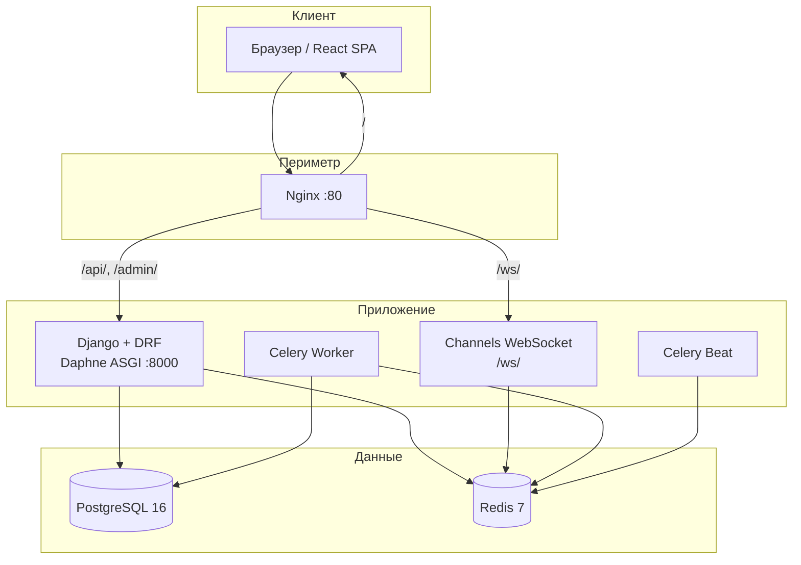
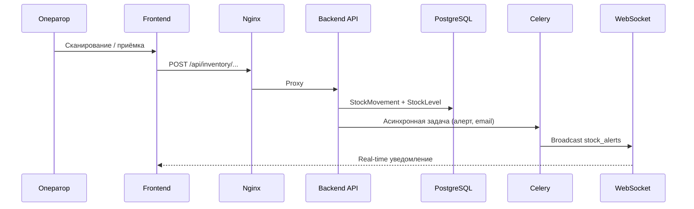
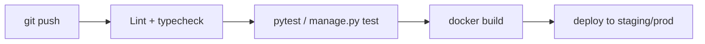

<div align="center">

# WarehouseIQ

**Комплексная WMS-платформа для управления складом, запасами и логистическими операциями — ваш собственный enterprise-склад под полным контролем.**

<br/>

[](https://www.python.org/)
[](https://www.djangoproject.com/)
[](https://www.django-rest-framework.org/)
[](https://react.dev/)
[](https://www.postgresql.org/)
[](https://redis.io/)
[](https://docs.celeryq.dev/)
[](https://channels.readthedocs.io/)

<br/>

[](https://docs.docker.com/compose/)
[](https://nginx.org/)
[](https://jwt.io/)
[](LICENSE)

</div>

---

## Содержание

1. [О проекте](#1-о-проекте)
2. [Ключевые возможности](#2-ключевые-возможности)
3. [Технологический стек](#3-технологический-стек)
4. [Структура репозитория](#4-структура-репозитория)
5. [Архитектура и как это работает](#5-архитектура-и-как-это-работает)
6. [Доменная модель (крупными блоками)](#6-доменная-модель-крупными-блоками)
7. [Сервисы в Docker Compose](#7-сервисы-в-docker-compose)
8. [Быстрый старт (локально, Docker)](#8-быстрый-старт-локально-docker)
9. [Основные команды](#9-основные-команды)
10. [Ручной запуск frontend и backend](#10-ручной-запуск-frontend-и-backend)
11. [Конфигурация и переменные окружения](#11-конфигурация-и-переменные-окружения)
12. [API, очереди и интеграции](#12-api-очереди-и-интеграции)
13. [Мониторинг и эксплуатация](#13-мониторинг-и-эксплуатация)
14. [CI/CD](#14-cicd)
15. [Безопасность и аудит](#15-безопасность-и-аудит)
16. [Роли компонентов в продакшене](#16-роли-компонентов-в-продакшене)
17. [Лицензия](#17-лицензия)
18. [Поддержка](#18-поддержка)

---

## 1. О проекте

**WarehouseIQ** — продуктовая **WMS** (Warehouse Management System) платформа уровня production для компаний, которым нужен единый контур управления складскими операциями: от приёмки и размещения товара до комплектации, отгрузки и аналитики — **в одном окне**.

| Аудитория | Что получает |
|-----------|--------------|
| **Операторы склада** | Веб-интерфейс: приёмка, сканирование штрихкодов, комплектация, отгрузка |
| **Менеджеры и руководители** | Мультисклад, зоны, отчёты, дашборды, алерты по остаткам |
| **Интеграторы и IT** | REST API, JWT, WebSocket-уведомления, фоновые задачи Celery |

### Что это за тип системы

Архитектура — **многосервисная распределённая платформа**, а не монолит «всё в одном процессе»:

| Аспект | Описание |
|--------|----------|
| **Продукт** | B2B WMS: учёт запасов, партии, движения, приёмка, picking, shipping, отчёты |
| **Архитектура** | Django API + React SPA + Celery workers + Channels (WebSocket) + Nginx |
| **Данные** | PostgreSQL (метаданные и транзакции) + Redis (кэш, брокер, pub/sub) + media volume (файлы, QR, аватары) |

---

## 2. Ключевые возможности

### Управление запасами (Inventory)

- Отслеживание остатков в реальном времени по складам, зонам и ячейкам
- SKU, штрихкоды (UPC/EAN) и генерация QR-кодов
- Партии (batch) с контролем срока годности
- Полная история движений (`StockMovement`) с типами операций
- Алерты низкого/избыточного остатка через **WebSocket** (`ws/stock-alerts/`)

### Складская инфраструктура (Warehouses)

- Поддержка **нескольких складов** с независимой конфигурацией
- Иерархия: **Warehouse → Zone → Location → Bin**
- Типы зон (приёмка, хранение, отгрузка, карантин и др.)
- Привязка менеджера склада и статусов (active / maintenance)

### Приёмка (Receiving)

- Заказы на приёмку с позициями и статусами
- Сканирование штрихкодов при приёмке
- Флаги качества и учёт повреждений
- Автоматическое обновление остатков после подтверждения

### Комплектация и упаковка (Picking)

- Pick-листы с приоритетами и статусами
- Позиции комплектации с отслеживанием точности
- Упаковочные листы (Packing Slip)

### Отгрузка (Shipping)

- Интеграция с перевозчиками: **UPS, FedEx, USPS, DHL**
- Трекинг отправлений и статусы доставки
- API-ключи перевозчиков через переменные окружения

### Отчёты и аналитика (Reports)

- Сводки по запасам и оценка стоимости
- Аналитика движений
- Метрики загрузки склада и эффективности комплектации
- Экспорт (import-export, Excel, PDF через ReportLab)

### Безопасность и доступ

- **JWT** (access + refresh) с настраиваемым временем жизни
- Роли: Admin, Manager, Staff, Viewer
- Права на уровне склада (`WarehouseStaff`)
- Middleware аудита изменений данных

---

## 3. Технологический стек

| Слой | Технологии |
|------|------------|
| **Backend** | Python 3.12+, Django 5.1, Django REST Framework, SimpleJWT |
| **Frontend** | React 18, Redux Toolkit, TypeScript |
| **БД** | PostgreSQL 16 |
| **Кэш / брокер** | Redis 7 |
| **Фоновые задачи** | Celery 5.4 + django-celery-beat |
| **Real-time** | Django Channels 4.2 + Daphne (ASGI) |
| **Сканирование** | python-barcode, qrcode, pyzbar |
| **Прокси** | Nginx 1.25 |
| **Контейнеризация** | Docker + Docker Compose 3.9 |

---

## 4. Структура репозитория

```
WarehouseIQ/
├── backend/
│   ├── apps/
│   │   ├── accounts/       # Пользователи, роли, привязка к складам
│   │   ├── warehouses/     # Склады, зоны, локации, ячейки
│   │   ├── inventory/      # Товары, SKU, остатки, движения, алерты
│   │   ├── receiving/      # Приёмка входящих поставок
│   │   ├── picking/        # Комплектация и упаковка
│   │   ├── shipping/       # Отгрузки и перевозчики
│   │   └── reports/        # Отчёты и аналитика
│   ├── config/             # settings, urls, celery, asgi/wsgi
│   ├── middleware/         # warehouse_context, audit
│   ├── utils/              # pagination, barcode, export
│   ├── manage.py
│   ├── requirements.txt
│   └── Dockerfile
├── frontend/
│   ├── public/
│   └── src/
│       ├── api/            # HTTP-клиент и эндпоинты
│       ├── components/     # UI-компоненты по доменам
│       ├── pages/          # Страницы (Dashboard, Settings, …)
│       ├── store/          # Redux store
│       ├── hooks/          # useAuth, useApi
│       └── styles/
├── nginx/
│   └── nginx.conf          # Reverse proxy, /api, /ws, static
├── docker-compose.yml
├── .env.example
└── README.md
```

---

## 5. Архитектура и как это работает

### Общая схема



### Типовой поток: движение товара



### Принципы

- **API-first:** вся бизнес-логика доступна через REST; SPA — основной UI
- **Разделение чтения/записи:** тяжёлые отчёты и периодические проверки — в Celery Beat
- **Контекст склада:** middleware `warehouse_context` для мультискладных запросов
- **Аудит:** middleware `audit` фиксирует изменения критичных сущностей

---

## 6. Доменная модель (крупными блоками)

| Домен | Основные сущности | Назначение |
|-------|-------------------|------------|
| **Accounts** | `User`, `Role`, `WarehouseStaff` | Аутентификация, RBAC, доступ к складам |
| **Warehouses** | `Warehouse`, `Zone`, `Location`, `Bin` | Физическая и логическая структура склада |
| **Inventory** | `SKU`, `Product`, `Batch`, `StockLevel`, `StockMovement`, `StockAlert` | Каталог, остатки, движения, алерты |
| **Receiving** | `ReceivingOrder`, `ReceivingItem` | Входящие поставки |
| **Picking** | `PickList`, `PickItem`, `PackingSlip` | Комплектация и упаковка |
| **Shipping** | `Carrier`, `Shipment` | Отгрузка и перевозчики |
| **Reports** | Сервисы агрегации | Сводки, аналитика, экспорт |

Все ключевые сущности используют **UUID** в качестве первичного ключа — удобно для распределённых интеграций и внешних систем.

---

## 7. Сервисы в Docker Compose

| Сервис | Образ / сборка | Порт | Роль |
|--------|----------------|------|------|
| `db` | `postgres:16-alpine` | 5432 | Основное хранилище метаданных |
| `redis` | `redis:7-alpine` | 6379 | Кэш, Celery broker, Channels layer |
| `backend` | `./backend` | 8000 | API + ASGI (Daphne), миграции при старте |
| `celery_worker` | `./backend` | — | Фоновые задачи (concurrency=4) |
| `celery_beat` | `./backend` | — | Периодические задачи (DatabaseScheduler) |
| `frontend` | `./frontend` | — | Сборка React → volume `frontend_build` |
| `nginx` | `nginx:1.25-alpine` | 80 | Единая точка входа, gzip, proxy WebSocket |

**Volumes:** `postgres_data`, `redis_data`, `static_files`, `media_files`, `frontend_build`

---

## 8. Быстрый старт (локально, Docker)

### Требования

- [Docker](https://docs.docker.com/get-docker/) и Docker Compose
- Git

### Установка за 5 шагов

```bash
# 1. Клонирование
git clone https://github.com/NodirOdilov/WarehouseIQ.git
cd WarehouseIQ

# 2. Конфигурация окружения
cp .env.example .env
# Отредактируйте SECRET_KEY, пароли БД и Redis

# 3. Запуск всех сервисов
docker compose up --build -d

# 4. Суперпользователь (миграции выполняются при старте backend)
docker compose exec backend python manage.py createsuperuser

# 5. Проверка
curl -s -o /dev/null -w "%{http_code}" http://localhost/api/auth/verify/
```

### Точки доступа

| URL | Назначение |
|-----|------------|
| http://localhost | React-приложение (через Nginx) |
| http://localhost/api/ | REST API |
| http://localhost/admin/ | Django Admin |
| http://localhost/ws/stock-alerts/ | WebSocket алертов по остаткам |

---

## 9. Основные команды

> В проекте нет Makefile — используйте `docker compose` и стандартные CLI-инструменты.

```bash
# Статус контейнеров
docker compose ps

# Логи (все сервисы / один сервис)
docker compose logs -f
docker compose logs -f backend

# Перезапуск после изменения .env
docker compose down && docker compose up -d

# Миграции вручную
docker compose exec backend python manage.py migrate

# Создание суперпользователя
docker compose exec backend python manage.py createsuperuser

# Django shell
docker compose exec backend python manage.py shell

# Тесты backend
docker compose exec backend python manage.py test

# Остановка и удаление volumes (ОСТОРОЖНО: удалит данные БД)
docker compose down -v
```

---

## 10. Ручной запуск frontend и backend

Подходит для разработки без полного Docker-стека (нужны локальные PostgreSQL и Redis).

### Backend

```bash
cd backend
python -m venv venv

# Windows
venv\Scripts\activate
# Linux / macOS
source venv/bin/activate

pip install -r requirements.txt
cp ../.env.example ../.env   # при необходимости
python manage.py migrate
python manage.py runserver
# ASGI + WebSocket (альтернатива runserver):
# daphne -b 0.0.0.0 -p 8000 config.asgi:application
```

### Celery

```bash
cd backend
celery -A config worker -l info
celery -A config beat -l info --scheduler django_celery_beat.schedulers:DatabaseScheduler
```

### Frontend

```bash
cd frontend
npm install
npm start
# По умолчанию: http://localhost:3000
# Укажите CORS_ALLOWED_ORIGINS в .env для backend
```

---

## 11. Конфигурация и переменные окружения

Скопируйте `.env.example` → `.env`. Основные группы:

| Группа | Переменные | Назначение |
|--------|------------|------------|
| **Django** | `SECRET_KEY`, `DEBUG`, `ALLOWED_HOSTS`, `DJANGO_SETTINGS_MODULE` | Безопасность и режим |
| **PostgreSQL** | `POSTGRES_*`, `DATABASE_URL` | Подключение к БД |
| **Redis** | `REDIS_PASSWORD`, `REDIS_URL` | Кэш и Channels |
| **Celery** | `CELERY_BROKER_URL`, `CELERY_RESULT_BACKEND` | Очереди задач |
| **CORS** | `CORS_ALLOWED_ORIGINS` | Домены SPA |
| **JWT** | `ACCESS_TOKEN_LIFETIME_MINUTES`, `REFRESH_TOKEN_LIFETIME_DAYS` | Срок жизни токенов |
| **Email** | `EMAIL_HOST`, `EMAIL_PORT`, … | Уведомления |
| **Перевозчики** | `UPS_*`, `FEDEX_*`, `USPS_*`, `DHL_*` | Shipping API |
| **Алерты** | `DEFAULT_LOW_STOCK_THRESHOLD`, `STOCK_ALERT_CHECK_INTERVAL_MINUTES` | Пороги остатков |
| **Nginx** | `NGINX_PORT` | Внешний порт (по умолчанию 80) |

Полный список с комментариями — в файле [`.env.example`](.env.example).

**Настройки Django по окружениям:**

- `config.settings.development` — локальная разработка
- `config.settings.production` — Docker / продакшен

---

## 12. API, очереди и интеграции

### Аутентификация (JWT)

| Метод | Путь | Описание |
|-------|------|----------|
| `POST` | `/api/auth/login/` | Получение пары access / refresh |
| `POST` | `/api/auth/refresh/` | Обновление access-токена |
| `POST` | `/api/auth/verify/` | Проверка токена |

Заголовок запросов: `Authorization: Bearer <access_token>`

### Основные REST-эндпоинты

| Префикс | Описание |
|---------|----------|
| `/api/accounts/` | Пользователи и профили |
| `/api/warehouses/` | Склады, зоны, локации |
| `/api/inventory/` | Товары, остатки, движения, `/scan/` |
| `/api/receiving/` | Заказы на приёмку |
| `/api/picking/` | Pick-листы, упаковка |
| `/api/shipping/` | Отправления и перевозчики |
| `/api/reports/` | Отчёты и аналитика |

### WebSocket

```
ws://<host>/ws/stock-alerts/
```

Группа Channels: `stock_alerts` — broadcast при срабатывании `StockAlert`.

### Celery

- **Worker:** обработка задач (уведомления, тяжёлые отчёты, проверка остатков)
- **Beat:** периодические задачи через `django_celery_beat` (расписание в БД)
- **Broker / backend:** Redis (отдельные DB index: 0 — cache, 1 — broker, 2 — results)

### Внешние интеграции

- API перевозчиков (UPS, FedEx, USPS, DHL) — ключи в `.env`
- SMTP для email-уведомлений
- Экспорт данных: `django-import-export`, Excel (`openpyxl`), PDF (`reportlab`)

---

## 13. Мониторинг и эксплуатация

| Область | Рекомендация |
|---------|--------------|
| **Healthcheck** | `db` и `redis` имеют healthcheck в Compose — backend стартует после `healthy` |
| **Логи** | `docker compose logs -f <service>`; в production — централизованный сбор (Loki, ELK) |
| **Метрики** | Подключите APM к Django/Celery; мониторинг Redis и PostgreSQL |
| **Резервное копирование** | Volume `postgres_data` — регулярные snapshot / pg_dump |
| **Масштабирование** | Горизонтально: несколько `celery_worker`; backend за балансировщиком с sticky sessions для WS |
| **Статика и media** | Volumes `static_files`, `media_files`; в prod — S3-совместимое хранилище (опционально) |

### Периодические задачи

- Проверка порогов остатков (`STOCK_ALERT_CHECK_INTERVAL_MINUTES`)
- Celery Beat через DatabaseScheduler — расписание редактируется в Django Admin

---

## 14. CI/CD

> В репозитории пока нет готового pipeline `.github/workflows/`. Рекомендуемый контур:



**Минимальный чеклист для pipeline:**

1. `python manage.py test` (backend)
2. `npm test` / `npm run build` (frontend)
3. `docker compose build` — проверка образов
4. Миграции на staging перед продакшеном
5. Секреты только через CI variables, не в git

---

## 15. Безопасность и аудит

| Механизм | Реализация |
|----------|------------|
| **Аутентификация** | JWT (SimpleJWT), email как `USERNAME_FIELD` |
| **Авторизация** | Роли User + `WarehouseStaff` per warehouse |
| **Транспорт** | В production — TLS на Nginx (Let's Encrypt / корпоративный сертификат) |
| **CORS** | Явный whitelist `CORS_ALLOWED_ORIGINS` |
| **Секреты** | `SECRET_KEY`, пароли БД/Redis — только через `.env` / secrets manager |
| **Аудит** | Middleware `audit` — журнал изменений |
| **Загрузка файлов** | `client_max_body_size 100M` в Nginx |
| **DEBUG** | `DEBUG=False` в production обязательно |

**Не коммитьте:** `.env`, ключи перевозчиков, production `SECRET_KEY`.

---

## 16. Роли компонентов в продакшене

| Компонент | Роль в prod |
|-----------|-------------|
| **Nginx** | TLS termination, gzip, rate limiting, единый ingress |
| **Backend (Daphne)** | REST API + WebSocket; за Gunicorn/Daphne — несколько воркеров при нагрузке |
| **PostgreSQL** | Primary metadata store; реплика read-replica для отчётов (опционально) |
| **Redis** | Broker Celery, cache, Channels layer — отдельные инстансы при высокой нагрузке |
| **Celery Worker** | Асинхронная обработка; autoscale по длине очереди |
| **Celery Beat** | Один активный scheduler (leader election или singleton) |
| **Frontend** | Статическая сборка в CDN или volume за Nginx |
| **Volumes** | Персистентность БД, media (QR, аватары), static |

---

## 17. Лицензия

Программное обеспечение является **проприетарным** (proprietary). Все права защищены.

Использование, копирование и распространение — только с явного разрешения правообладателя.

---

## 18. Поддержка

| Канал | Действие |
|-------|----------|
| **Issues** | [GitHub Issues](https://github.com/NodirOdilov/WarehouseIQ/issues) — баги и предложения |
| **Документация** | Этот README + комментарии в `.env.example` |
| **Admin** | `/admin/` — оперативное управление сущностями |
| **Разработка** | Fork → feature branch → Pull Request |

При сообщении об ошибке укажите: версию Docker, содержимое `.env` (без секретов), шаги воспроизведения и фрагмент логов `docker compose logs backend`.

---

<div align="center">

**WarehouseIQ** — умный склад начинается с умной системы.

*Сделано с вниманием к деталям операционной логистики.*

</div>
